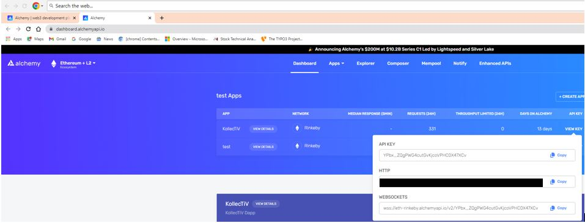

# The KollekTiV - Final Project

## Setup
1) Clone the repo
2) Open visual studio code or preferred terminal
3) From terminal, navigate to the Folder that is the repo just cloned
4) Run the following command:

   a) npm install --force
  
5) Ensure you have environment file (.env) with correct variables in the root directory (the root directory should be where you see config.js files in our case)

   a) the enviroment variables should be named and sourced from the following:
      - NEXT_PUBLIC_ALCHEMY_RPCURL=insert http api key link here
        - Create an Alchemy account at [Alchemy.com](https://www.alchemy.com/), and use the HTTP link version of the api key
        
        
      - NEXT_PUBLIC_FORMATIC_KEY=insert fortmatic key here
        - Create an Fortmatic account at [Fortmatic.com](https://fortmatic.com/), sign in with Github, and use the testnet version (Rinkeby) API Key, if releaseing to the Mainnet, use the Production key
        
        
      - NEXT_PUBLIC_DAPP_ID=insert blocknative key here
        - Create an blocknative account at [blocknative.com](https://www.blocknative.com/), create a new api key
        
        
      - METAMASK_PRIVATE_KEY=insert metamask private key here
        - The Metmask key should correspond to the testnet we are using, Rinkeby, create an account on the rinkeby testnet (click to Show/Hide networks when clicking on the metamask fox, and the account listed will be of your Rinkeby account. 
        - Inside metamask, click the 3 dot hamburger, click account details, click export private key, enter your password for metamask, and copy and paste your private key in.
      - ETHERSCAN_API_KEY=insert etherscan API key here
        - Create an Etherscan account at [etherscan.io](https://etherscan.io/login), click on API Keys, and create a new api key
        
        
     
6) Run the following command in the terminal:
   npm run dev
7) Within the terminal if succesfully compiled, a line should state:

   Ready - started server on 0.0.0.0:3000, url: http://localhost:3000
   
   Click on the localhost:3000 link
